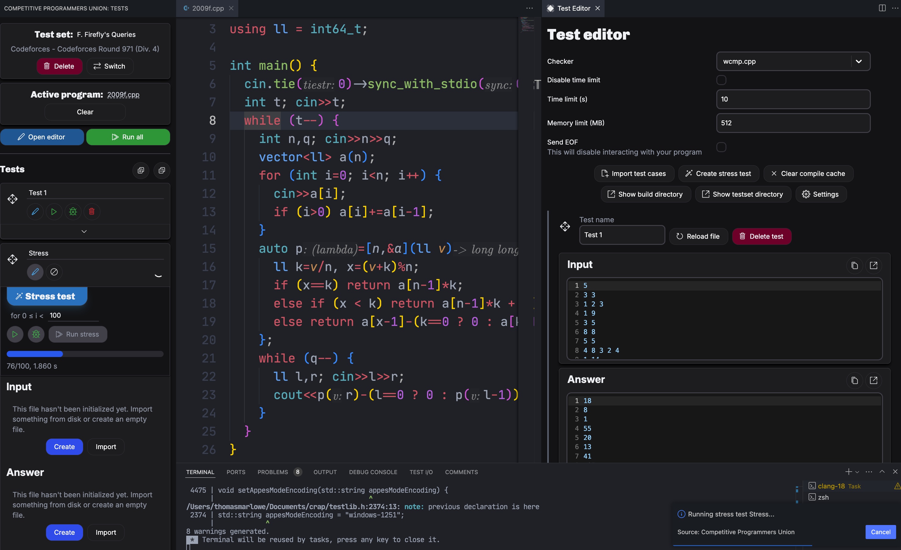

# What's this, another CPH/acmX/FastOlympicCoding/... clone?

Yep. I think it looks *slightly* better than any solution out there, though, and has maybe half a feature more?

Designed primarily for C++ (though you're able to run Java/C++/Python and maybe Rust, though I haven't tested it). Integrates with clangd and CodeLLDB to provide compilation commands and debugging. Developed on MacOS and hasn't been tested on Windows/Linux. If you can't tell already, this extension was made for me, but if you, for some reason, think it's the best option out there for you and need a couple features/fixes, just open an issue on the Github.

# Notes

- The run/debug options for stress tests run/debug the test generator for a random choice of `i`.
- Integrates with [Competitive Companion](https://github.com/jmerle/competitive-companion/tree/master), though uses the host port for Hightail (so you won't be able to use both of our integrations at once)
- I feel incompetent because whenever I implement things it seems 10x more complicated than it needs to be, which creates so many failure modes. This thing is not super robust and I expect to discover many bugs.
	- If you ever want to laugh at some sad code, this is a goldmine!
	- To reiterate: **this is basically in alpha! I've made it public to source feedback from friends like you and hope to substantially improve it.**

Built with React, bundled with ESBuild.